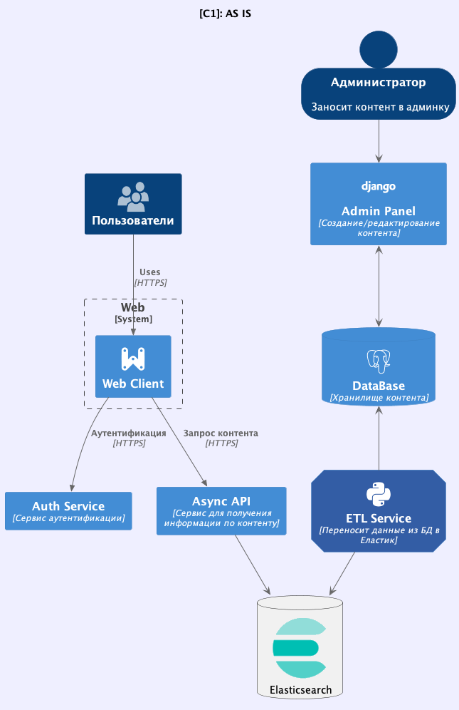
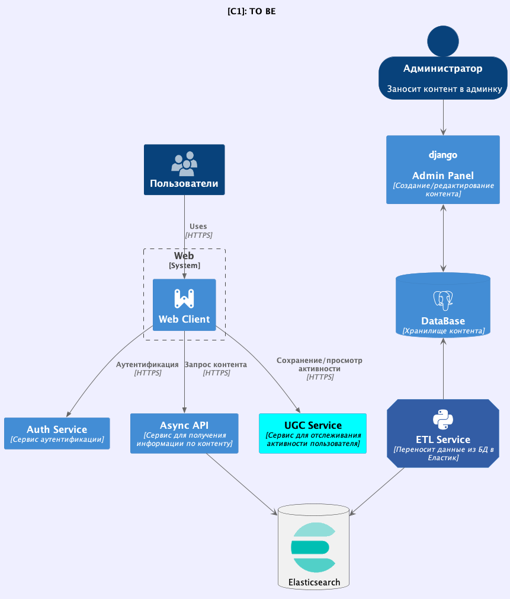
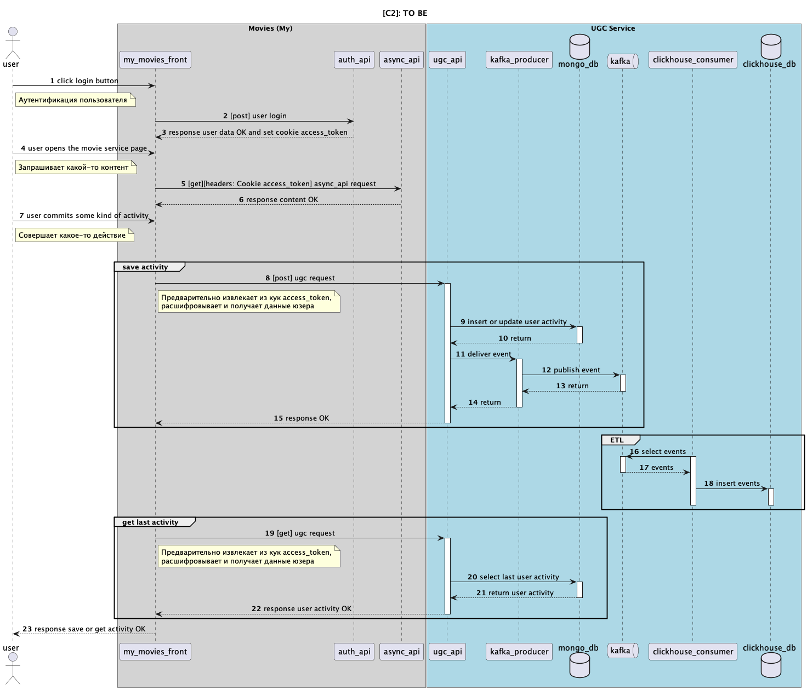
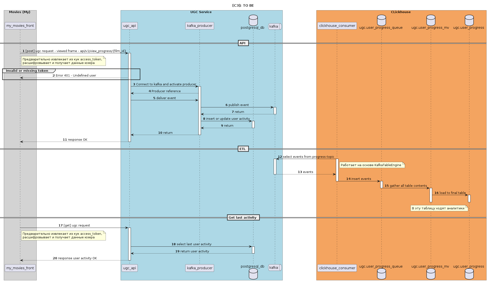

# Movies UGC service

## Contributors

- Vladimir Nikishov - T1rax - @nikishov.va
- Victoria Axentii - wiky-avis - @wikyavis
- Oleg Podryadov - opodryadov - @oleg_podryadov

## Major components

- Event storage - kafka
- Event API - loads events to event storage
- NoSQL Database - MongoDB
- OLAP Database - Clickhouse
- ETL - loads events from event storage to database for analytical purposes (Kafka Table Engine)
- ELK (Elasticsearch Logstash Kibana) - used for centralized collection, processing, and visualization of logs and metrics in real-time to enable proactive monitoring and analysis of a project.
- Sentry - used for monitoring and tracking errors in an application, allowing for quick detection, analysis, and resolution of issues to improve the reliability and stability of the project.
- Jaeger - used for performance testing and load testing web applications, allowing to assess and analyze their ability to handle various loads and conditions, to ensure optimal project performance.

## How to start app

Project uses makefiles to boot apps. There are mulltiple boot configurations: production and development.
The difference is that dev has open ports and separate volumes. Tests boot on dev environment.

### Steps to follow

#### Boot everything in production mode

1. `make up-prod`

#### Boot everything in development mode (open ports and separate volumes)

1. `make up-local`

#### E2E tests

1. Uncomment in e2e tests in docker-compose-local.yml
2. `make up-local`

#### Unit tests

1. Up python virtual env - venv
2. Install dependencies - `poetry install`
3. Run `pytest tests/src/unit`

#### ELK
1. `make up-elk`

#### Sentry
1. Turn on **ENABLE_SENTRY** in your .env-file
2. Set your dsn from sentry.io to **SENTRY_DSN** in your .env-file

#### Jaeger
1. Turn on **ENABLE_TRACER** in your .env-file

## Useful commands

### Production

- Up+build `make up-prod`
- Up+build+detach `make up-prod-d`
- Down `make down-prod`

### Development/test

- Up+build `make up-local`
- Up+build+detach `make up-local-d`
- Down + remove volumes `make down-local`

### ELK
- Up+build+detach `make up-elk`
- Down `make down-elk`

## API information

**Swagger** - http://localhost/swagger

### Schemas

PlantUML schemas could be found in folder docs.
They are written in C$ notation up to C3 level.
More about C4 notation - https://c4model.com

#### Contents

- As-Is - Infrastructure before this project
- To-Be - Information about this project

## Schemas images

### AS IS

#### C1 as is

#### C2 as is

### TO BE

#### C1 to be

#### C2 to be

#### C3 to be

